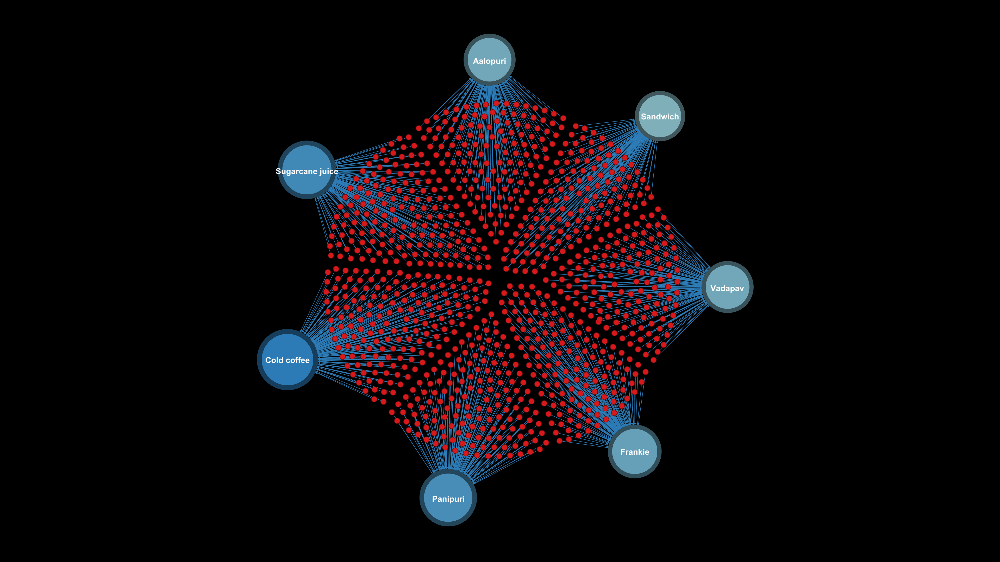

## 🍔 Question 1 - Most Popular Food Items by Customer Interactions

**Question:**  
*کدام آیتم‌های غذایی بیشترین تعامل (به اشتراک‌گذاری، نظر، توصیه) را در شبکه دارند؟ (محبوب‌ترین آیتم‌ها)*

**Dataset:**  
`a0-ECDSa16-ResturantSales`

**Use Case:**  
👨‍🍳 مدیر رستوران یا تیم بازاریابی برای بهبود تبلیغات و مدیریت موجودی غذا.

---

### 🧠 Insights

- تحلیل مبتنی بر **Degree Centrality** برای تشخیص آیتم‌هایی با بیشترین ارتباط با سفارشات مشتری.
- شناسایی آیتم‌های محبوب در شبکه بر اساس فراوانی سفارش.
- امکان تصمیم‌گیری دقیق‌تر برای تبلیغات یا حذف آیتم‌های کم‌تعامل.

---

### 🧾 Network Design

**🔵 Nodes:**  
- `order_id`: هر سفارش به‌عنوان یک نود  
- `item_type`: نوع آیتم غذایی

**🔗 Edges:**  
- ارتباط بین سفارش و آیتم غذایی  
- وزن لبه‌ها = تعداد دفعات سفارش یک غذا توسط یک مشتری خاص

**🎨 Visual Encoding:**  
- گره‌های آیتم غذایی: آبی  
- گره‌های سفارش: قرمز  
- اندازه گره: بر اساس درجه (Degree)  
- رنگ یال‌ها: یکنواخت

---

### 🖼️ Network Graph Preview

---

### 📁 Included Files

| File Name     | Description                                 |
|---------------|---------------------------------------------|
| `1.gephi`     | Gephi project file with full analysis       |
| `nodes.csv`   | Node list: orders and item types            |
| `edges.csv`   | Edges between orders and food items         |
| `1.png`       | Final network visualization (above)         |

---

> 📌 *این تحلیل می‌تواند مستقیماً در تصمیم‌گیری‌های بازاریابی یا بهینه‌سازی منو در رستوران‌ها استفاده شود.*

