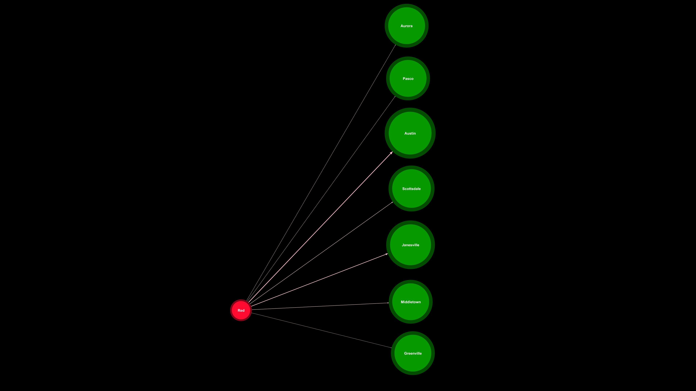
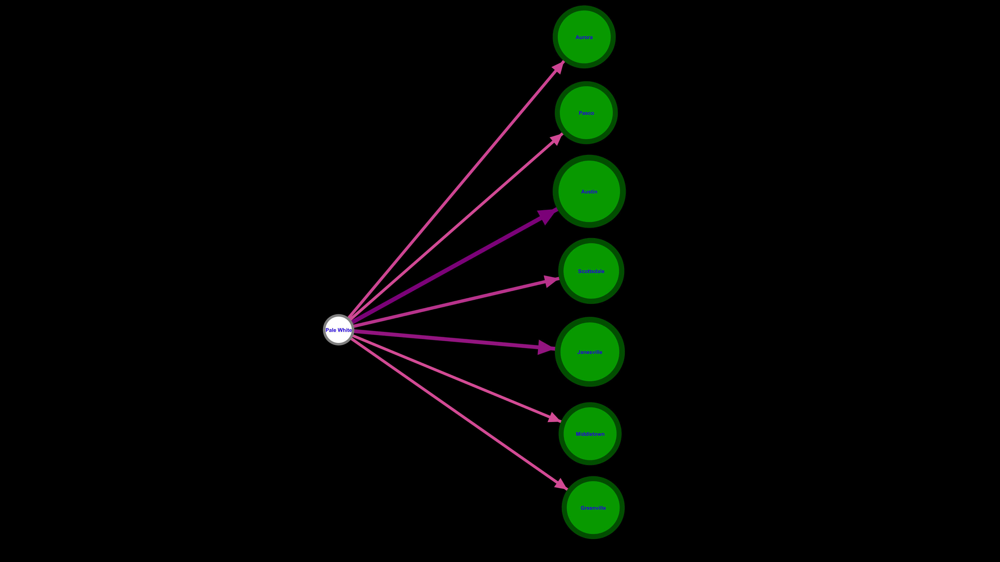

## 🚗 Question 10 - تحلیل رنگ خودرو و منطقه جغرافیایی فروش

**Question:**  
آیا بین رنگ خودرو و منطقه جغرافیایی، ارتباطی در شبکه‌های اجتماعی میان فروشندگان و خریداران دیده می‌شود؟

**Dataset:**  
`a2-ECDS4-CarSales (Car_Sales_Report)`  
📌 تحلیل داده‌های فروش خودرو، تمرکز بر رنگ خودرو و نمایندگی‌های جغرافیایی

**Use Case:**  
🏢 برای تصمیم‌گیری نمایندگی‌ها جهت تنظیم موجودی براساس رنگ‌های محبوب در هر منطقه

---

### 🧠 Insights

- شناسایی پراکندگی رنگ‌های پرطرفدار در مناطق مختلف جغرافیایی
- تحلیل پل‌های ارتباطی بین رنگ‌ها و مناطق (community bridging)
- امکان تنظیم موجودی نمایندگی براساس رنگ‌های پرفروش در منطقه مربوطه

---

### 🧾 Network Design

**🔵 Nodes:**  
- `Color`: رنگ خودرو (مثلاً قرمز، سفید، مشکی)  
- `Dealer Region`: منطقه جغرافیایی نمایندگی

**🔗 Edges:**  
- ارتباط بین رنگ خودرو و منطقه فروشنده  
- وزن یال = تعداد معاملات با آن رنگ در آن منطقه

**🎨 Visual Encoding:**  
- رنگ‌های پرطرفدار → گره‌های بزرگ‌تر  
- خوشه‌بندی رنگ‌ها و مناطق براساس الگوی فروش  
- نمایش پل‌ها (Bridges) بین مناطق و رنگ‌ها

---

### 🗂️ Dataset Structure

- `nodes.csv`: شامل نام رنگ خودرو و منطقه نمایندگی  
- `edges.csv`: شامل ارتباط میان رنگ‌ها و مناطق براساس تعداد معاملات  
- `10.gephi`: فایل شبکه آماده تحلیل در Gephi

---

### 🖼️ Visual Graph Samples

  
  
  
  

---

### 📁 Included Files

| File Name     | Description                                              |
|---------------|----------------------------------------------------------|
| `10.gephi`    | Gephi project file for network analysis                  |
| `nodes.csv`   | Nodes containing car colors and dealership regions       |
| `edges.csv`   | Edges representing transaction links between color/region|
| `10.png`      | Full network visualization                               |
| `Red.png`     | Subgraph: Car color - Red                                |
| `Black.png`   | Subgraph: Car color - Black                              |
| `White.png`   | Subgraph: Car color - White                              |

---

> 📌 *نمایندگی‌ها می‌توانند با استفاده از این تحلیل، تصمیم‌گیری بهتری درباره موجودی رنگ خودرو در مناطق مختلف داشته باشند و فروش را بهینه کنند.*

