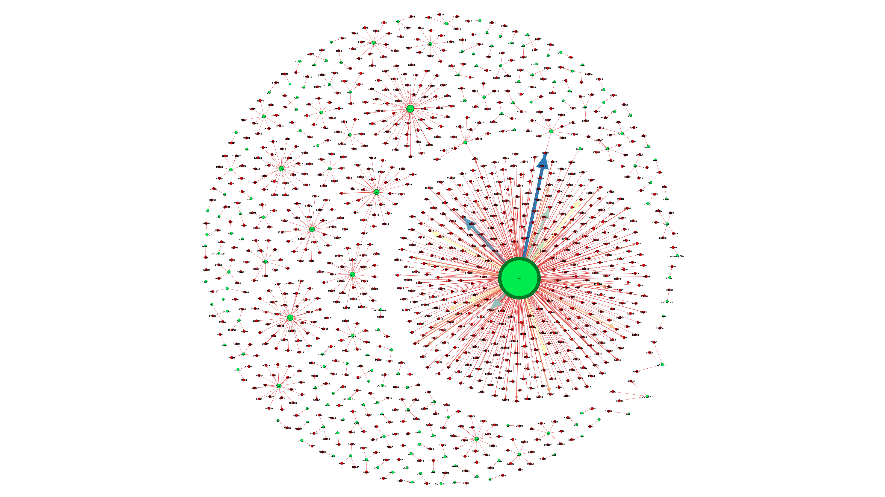
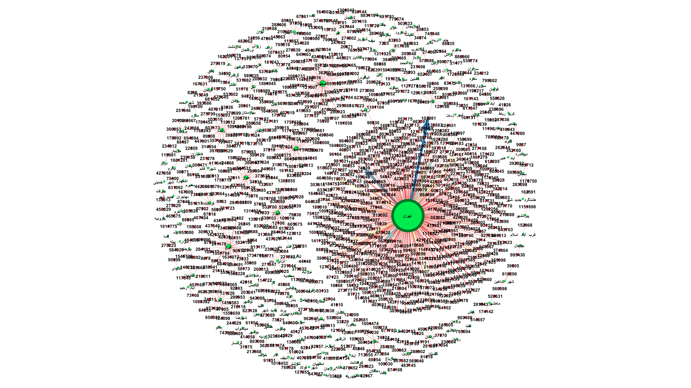
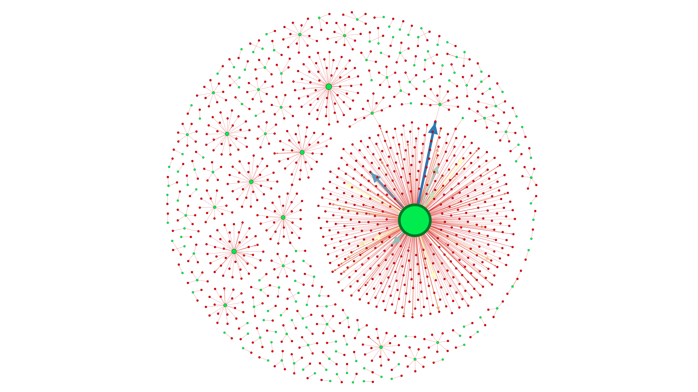
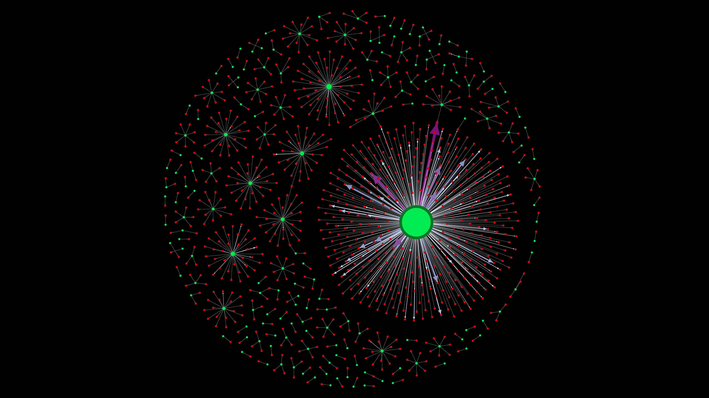

## 🗺️ Question 3 - Regional Purchase Patterns

**Question:**  
آیا مشتریان از یک شهر خاص به‌سمت خرید محصولات خاصی سوق داده می‌شوند؟

**Dataset:**  
`a0-ECDSa14-Orders` (⚠️ تحلیل بر اساس **نمونه‌گیری (Sampled Dataset)** به‌جای کل دیتاست، به دلیل محدودیت منابع سخت‌افزاری)

**Use Case:**  
🎯 برای تیم بازاریابی جهت شخصی‌سازی تبلیغات و ارائه پیشنهادهای محلی در هر منطقه

---

### 🧠 Insights

- تحلیل ارتباط بین `city_name_fa` (شهر مشتری) و `id_item` (محصول خریداری‌شده)
- شناسایی شهرهایی با تمرکز بالا بر محصولات خاص (مثلاً شهرهایی که بیشتر نوشیدنی خرید می‌کنند)
- اولویت‌بندی تبلیغات براساس محبوبیت منطقه‌ای

---

### 🧾 Network Design

**🔵 Nodes:**  
- `city_name_fa`: نام شهر (سبز رنگ)  
- `id_item`: شماره محصول (قرمز رنگ)

**🔗 Edges:**  
- اتصال شهر به محصولی که حداقل یک خرید از آن در شهر ثبت شده
- وزن یال‌ها = تعداد خرید آن محصول در آن شهر

**🎨 Visual Encoding:**  
- رنگ گره‌ها: محصولات (قرمز)، شهرها (سبز)  
- ضخامت یال: بر اساس تعداد خرید  
- طیف رنگی برای شدت خرید

---

### 🔍 Two Analysis Versions

📁 `Sample-1000`: تحلیل روی 1000 رکورد نمونه  
📁 `All`: تحلیل روی کل داده‌های فیلترشده (در صورت توان سخت‌افزاری)

---

### 🖼️ Visual Previews

  
  
  
  

---

### 📁 Included Files

| File/Folder        | Description                                        |
|--------------------|----------------------------------------------------|
| `3.gephi`          | Main Gephi file containing graph data              |
| `Sample-1000/`     | Visualization and output from sampled data         |
| `All/`             | Graph from complete dataset (if resources allow)   |
| `3-1.png` to `3-4.png` | Screenshots of various layout/metric views     |

---

> ⚠️ *تجزیه و تحلیل این سناریو با حجم کامل داده نیازمند سخت‌افزار قوی است. در اینجا از نمونه‌گیری استفاده شده است، اما روش تحلیل قابل تعمیم به کل داده‌ها می‌باشد.*

