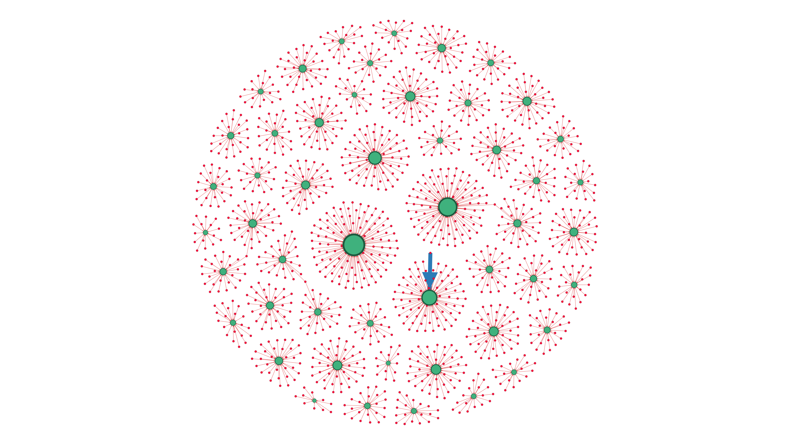
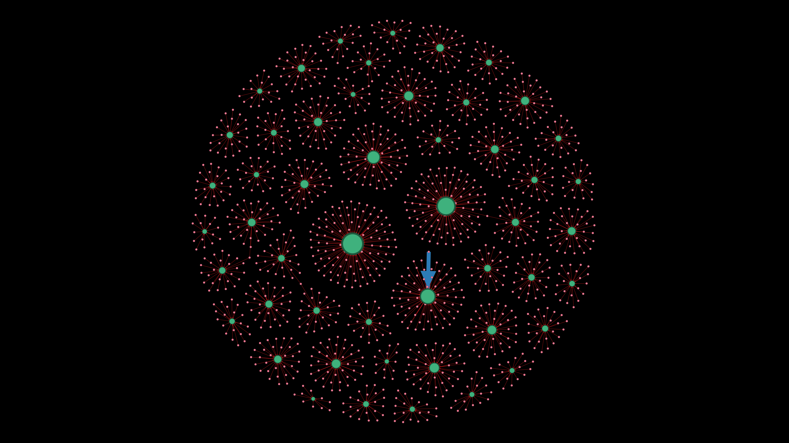
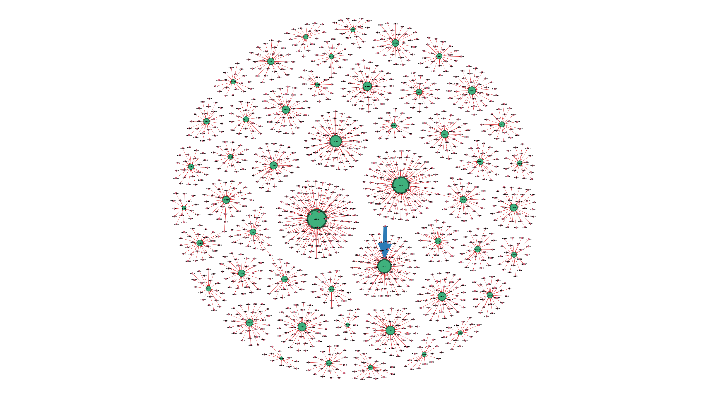

## 📦 Question 4 - Co-Purchased Products in Customer Network

**Question:**  
کدام محصولات در شبکه مشتریان بیشترین وابستگی به هم را دارند؟

**Dataset:**  
`a0-ECDSa14-Orders`  
📌 تحلیل بر اساس **نمونه‌گیری 1500 رکوردی** و نسخه‌ی کامل (در پوشه‌های جدا)

**Use Case:**  
🏬 برای واحد زنجیره تأمین جهت تشخیص محصولات هم‌خرید برای بهینه‌سازی انبارداری، پیشنهادات هم‌زمان و پک‌بندی کالاها.

---

### 🧠 Insights

- بررسی اینکه چه محصولاتی بیشتر توسط مشتریان مشابه خریداری شده‌اند.
- شناسایی جفت‌های پرتکرار از محصولات که معمولاً با هم سفارش داده می‌شوند.
- کشف خوشه‌های رفتاری در خرید مشتریان.

---

### 🧾 Network Design

**🔵 Nodes:**  
- `id_customer`: مشتریان (قرمز رنگ)  
- `id_item`: محصولات (سبز رنگ)

**🔗 Edges:**  
- هر بار که مشتری محصولی را خریداری می‌کند، یک یال بین آن دو ایجاد می‌شود.
- اگر چندین مشتری محصول مشترکی خریده باشند، آن محصول دارای Degree بالاتری خواهد بود.
- وزن یال = تعداد دفعات خرید آن محصول توسط آن مشتری

**🎨 Visual Encoding:**  
- محصولات → سبز، مشتریان → قرمز  
- ضخامت یال‌ها: بر اساس تعداد دفعات خرید  
- طیف رنگی برای شدت ارتباطات (محبوبیت)

---

### 🧪 Two Analysis Versions

| Folder          | Description                                      |
|------------------|--------------------------------------------------|
| `Sample-1500`    | تحلیل روی 1500 سفارش نمونه به دلیل محدودیت پردازش |
| `All`            | تحلیل کامل (در صورت توان سخت‌افزاری)              |

---

### 🖼️ Graph Visualizations

  
  
  

---

### 📁 Included Files

| File Name        | Description                                         |
|------------------|-----------------------------------------------------|
| `4.gephi`        | Gephi project file (network graph)                  |
| `Sample-1500/`   | Sample-based graph outputs                          |
| `All/`           | Full graph version (for stronger systems)           |
| `4-*.png`        | Screenshots from various layouts & centralities     |

---

> 📌 *تحلیل وابستگی محصولات بر اساس هم‌خریدی می‌تواند به ایجاد پک‌های پیشنهادی، بهینه‌سازی انبار و حتی تبلیغات هدفمند کمک کند.*

