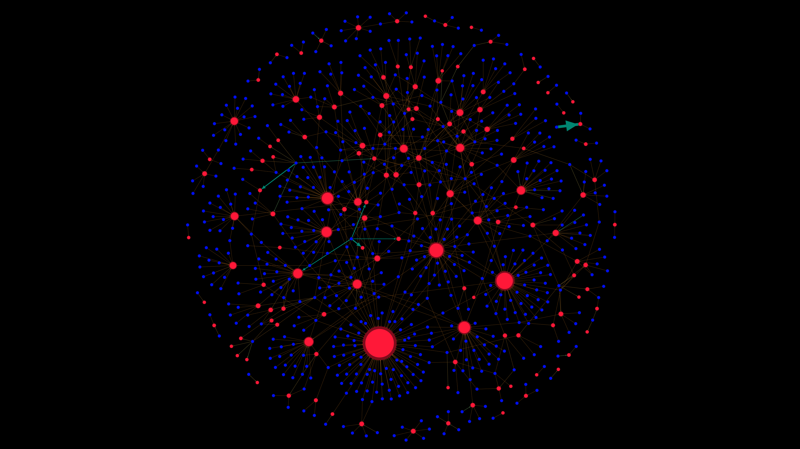
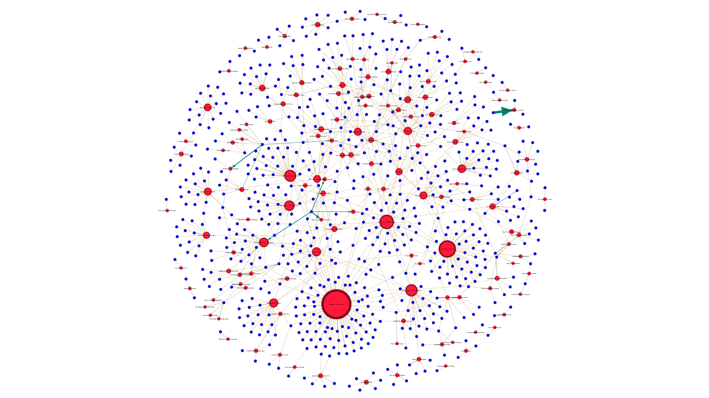
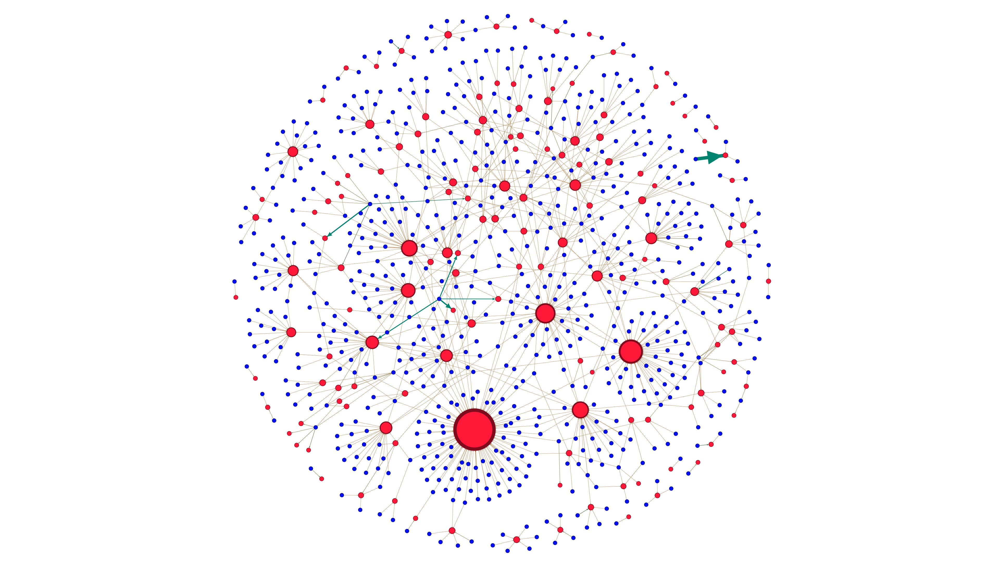

## ❌ Question 5 - Cancellation Patterns in Product Orders

**Question:**  
آیا گروه‌هایی از مشتریان وجود دارند که الگوهای لغو سفارش مشابهی دارند؟

**Dataset:**  
`a0-ECDS9-EcTransacts (Sales Transaction v.4a)`  
📌 تحلیل روی **نمونه‌ 1000 رکوردی** و نسخه‌ی کامل (در پوشه‌های جداگانه)

**Use Case:**  
🛠️ برای مدیر عملیات جهت بهینه‌سازی موجودی و کاهش نرخ لغو سفارش‌ها (Cancelation Rate)

---

### 🧠 Insights

- تحلیل رفتار مشتریانی که سفارش محصولی را لغو کرده‌اند.
- بررسی اینکه چه محصولات خاصی بیشتر در معرض لغو هستند.
- امکان شناسایی خوشه‌های مشتری با احتمال لغو بالا → مناسب برای پیش‌بینی، هشدار و تغییر موجودی

---

### 🧾 Network Design

**🔵 Nodes:**  
- `TransactionNo`: شماره سفارش (آبی رنگ)  
- `ProductName`: نام محصول سفارش داده شده (قرمز رنگ)

**🔗 Edges:**  
- یال بین تراکنش و محصول → نشانه‌ای از سفارش لغو شده آن محصول  
- وزن یال = تعداد لغوهای مشابه در تراکنش‌های مختلف توسط مشتریان مختلف  
- ضخامت یال: بر اساس فراوانی لغو

**🎨 Visual Encoding:**  
- مشتریانی با الگوهای مشابه لغو سفارش، به هم متصل می‌شوند  
- خوشه‌بندی جهت نمایش نقاط حساس (محصولات لغوشونده)

---

### 🔍 Analysis Versions

| Folder          | Description                                          |
|------------------|------------------------------------------------------|
| `Sample-1000`    | تحلیل روی دیتای نمونه (1000 رکورد) برای تسریع اجرا  |
| `All`            | تحلیل کامل (در صورت توان پردازشی)                    |

---

### 🖼️ Graph Visualizations

  
  
  

---

### 📁 Included Files

| File Name        | Description                                           |
|------------------|-------------------------------------------------------|
| `5.gephi`        | Gephi file containing the full cancellation network   |
| `Sample-1000/`   | Sample dataset visualizations                         |
| `All/`           | Full dataset visualizations (if hardware allows)      |
| `5-*.png`        | Screenshots of analysis views                         |

---

> 📌 *این تحلیل به شناسایی الگوهای پنهان لغو سفارش کمک می‌کند و می‌تواند از طریق الگوریتم‌های هشداردهنده، خسارت ناشی از لغوها را کاهش دهد.*

