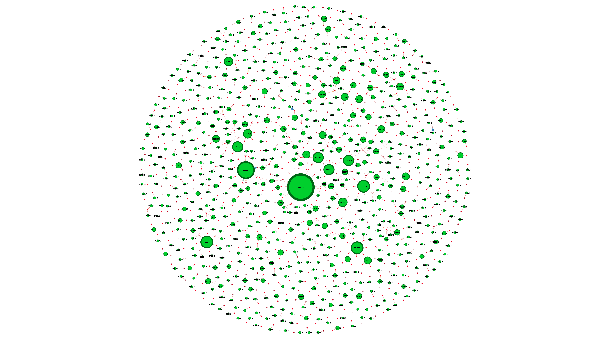
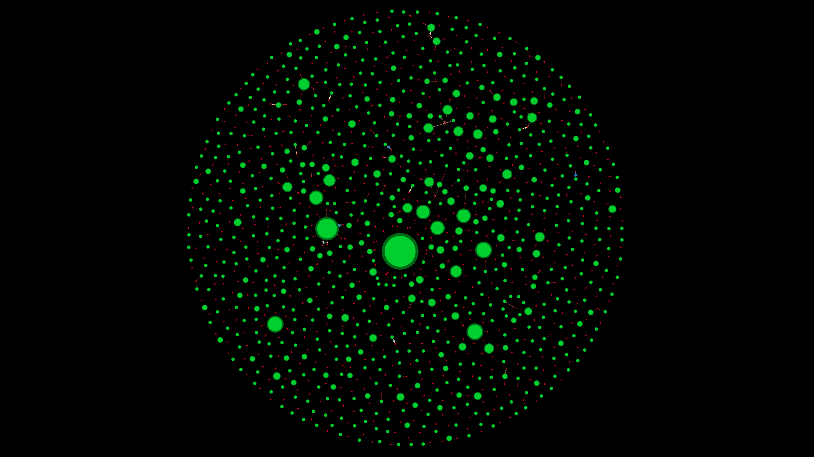
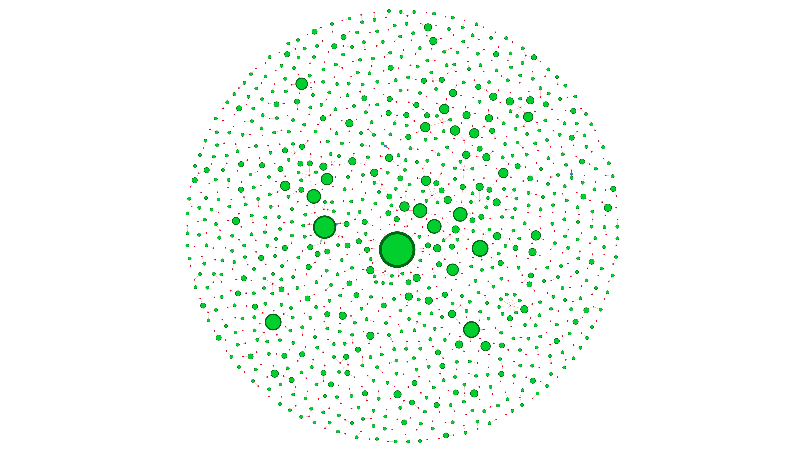

## 💰 Question 6 - Profitability-Based Customer Segmentation

**Question:**  
کدام گروه‌های مشتریان سودآوری بیشتری برای کسب‌وکار ایجاد می‌کنند؟

**Dataset:**  
`a0-ECDS9-EcTransacts (Sales Transaction v.4a)`  
📌 تحلیل روی **نمونه‌ 1000 رکوردی** + نسخه کامل (پوشه‌های مجزا)

**Use Case:**  
📊 برای مدیر مالی جهت بهینه‌سازی سیاست‌های قیمت‌گذاری، تخصیص تخفیف‌ها و اجرای برنامه‌های وفاداری مشتریان.

---

### 🧠 Insights

- شناسایی مشتریانی که تعداد خرید بالا و/یا ارزش خرید بالایی دارند
- کشف خوشه‌های سودآور (مشتریان بزرگ‌تر) در مقابل مشتریان کم‌سود یا موقت
- امکان پیشنهادهای ویژه به مشتریان کلیدی و کاهش هزینه‌ها برای مشتریان غیرهدف

---

### 🧾 Network Design

**🔵 Nodes:**  
- `CustomerNo`: شماره مشتری (سبز رنگ)  
- `ProductName`: نام محصول خریداری‌شده (قرمز رنگ)

**🔗 Edges:**  
- هر خرید بین مشتری و محصول → یک یال ایجاد می‌کند  
- وزن یال: تعداد دفعات خرید آن محصول توسط آن مشتری  
- اندازه گره مشتری: مجموع سود حاصل از او

**🎨 Visual Encoding:**  
- رنگ گره‌ها بر اساس نوع (مشتری/محصول)  
- طیف رنگی برای نمایش سودآوری  
- گره‌های بزرگ‌تر = مشتریان با سود بیشتر

---

### 🔍 Analysis Versions

| Folder          | Description                                          |
|------------------|------------------------------------------------------|
| `Sample-1000`    | تحلیل سبک‌تر با 1000 رکورد برای اجرای سریع‌تر        |
| `All`            | تحلیل کامل (برای سیستم‌های قدرتمند)                   |

---

### 🖼️ Visual Graph Snapshots

  
  
  

---

### 📁 Included Files

| File Name        | Description                                           |
|------------------|-------------------------------------------------------|
| `6.gephi`        | Network analysis project file (Gephi)                 |
| `Sample-1000/`   | Sample-based graph visualizations                      |
| `All/`           | Full analysis graphs (performance dependent)          |
| `6-*.png`        | Screenshots showcasing layout & centrality insights   |

---

> 📌 *تحلیل سودآوری مشتریان، به کسب‌وکارها کمک می‌کند تا منابع را به مشتریان پربازده اختصاص دهند و وفاداری آنان را افزایش دهند.*

