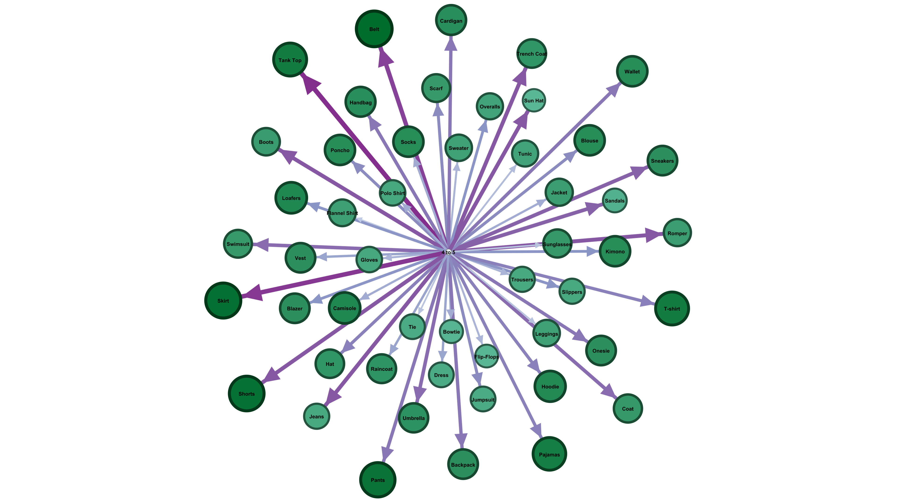
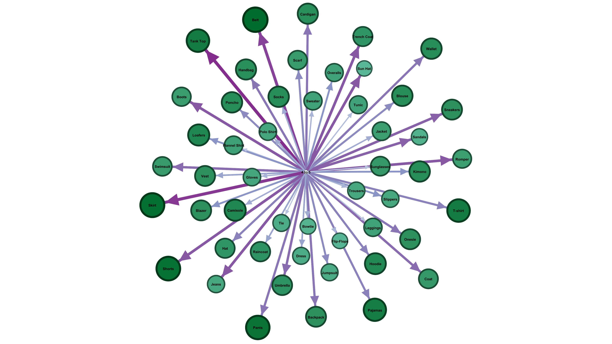

## 🌟 Question 7 - Distribution of Highly-Rated Products

**Question:**  
محصولات با بالاترین برخورد مثبت چگونه در شبکه توزیع شده‌اند؟

**Dataset:**  
`a1-ECDS7-FashionRetails (Fashion_Retail_Sales)`  
📌 تحلیل امتیاز مشتریان به محصولات + ساخت شبکه بین محصول و امتیاز

**Use Case:**  
🛍️ برای تیم فروش جهت تمرکز بر فروش بیشتر محصولات با امتیاز بالا و بهینه‌سازی استراتژی‌های فروش و نمایش کالاها.

---

### 🧠 Insights

- شناسایی محصولات با بالاترین امتیاز از سمت مشتریان (Review Rating)
- بررسی خوشه‌هایی از کالاها که بیشترین امتیاز مثبت گرفته‌اند
- امکان تصمیم‌گیری برای نمایش بیشتر این محصولات در ویترین یا کمپین‌های تبلیغاتی

---

### 🧾 Network Design

**🔵 Nodes:**  
- `Item Purchased`: نام محصول (سبز)  
- `Review Rating`: امتیاز داده‌شده توسط مشتری (آبی)

**🔗 Edges:**  
- هر محصول که امتیاز دریافت کرده باشد → یالی با وزن بر اساس تعداد دفعات دریافت آن امتیاز  
- اگر محصولی 30 بار امتیاز 5 گرفته، وزن یال 30 خواهد بود

**🎨 Visual Encoding:**  
- محصولات با بیشترین امتیاز → گره‌های بزرگ‌تر  
- طیف رنگی برای نمایش شدت محبوبیت  
- گراف دو-وجهی بین محصولات و امتیازها

---

### 🗂️ Dataset Structure

- `Nodes.csv`: شامل نام محصولات و امتیازات ممکن (1 تا 5)
- `Edges.csv`: ارتباط میان محصولات و امتیازات دریافتی
- `edit-dataset/`: نسخه ویرایش‌شده دیتاست خام جهت ساخت گراف

---

### 🖼️ Visual Graph Samples

  
  

---

### 📁 Included Files

| File Name        | Description                                            |
|------------------|--------------------------------------------------------|
| `7.gephi`        | Gephi network project file                             |
| `Nodes.csv`      | Product and rating nodes                               |
| `Edges.csv`      | Links based on customer ratings                        |
| `7-*.png`        | Network visualizations                                 |
| `edit-dataset/`  | Cleaned dataset used for network generation            |

---

> 📌 *محصولاتی که بیشترین امتیاز مثبت دارند، می‌توانند در اولویت نمایش، تبلیغ، یا قیمت‌گذاری ویژه قرار بگیرند تا فروش بهینه شود.*

