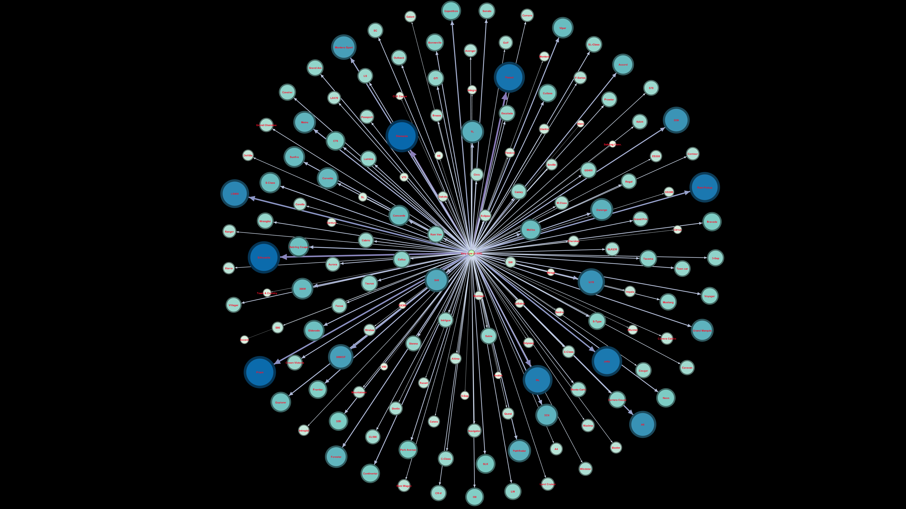
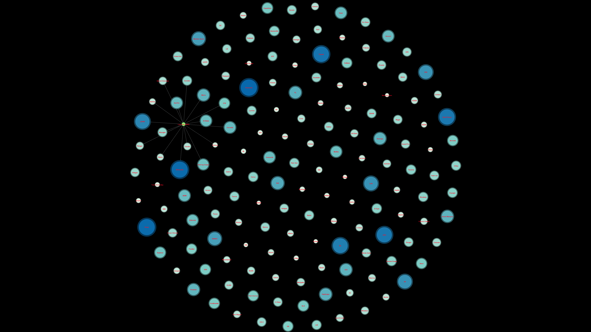
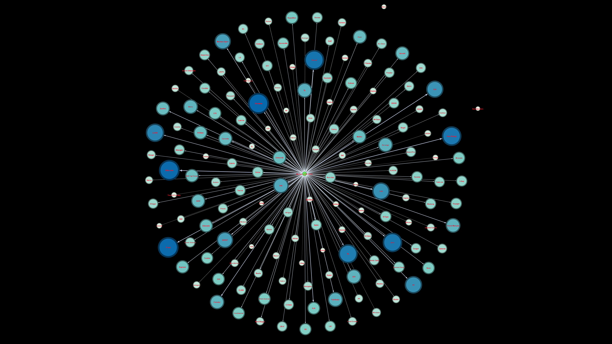
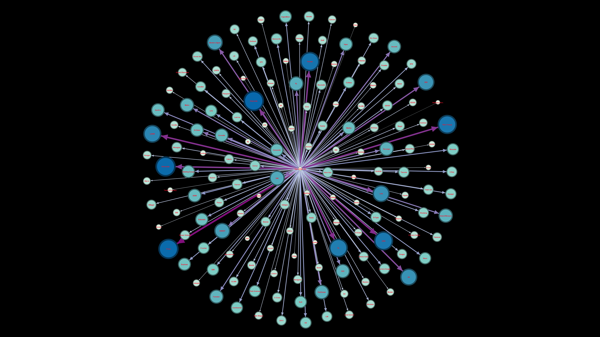
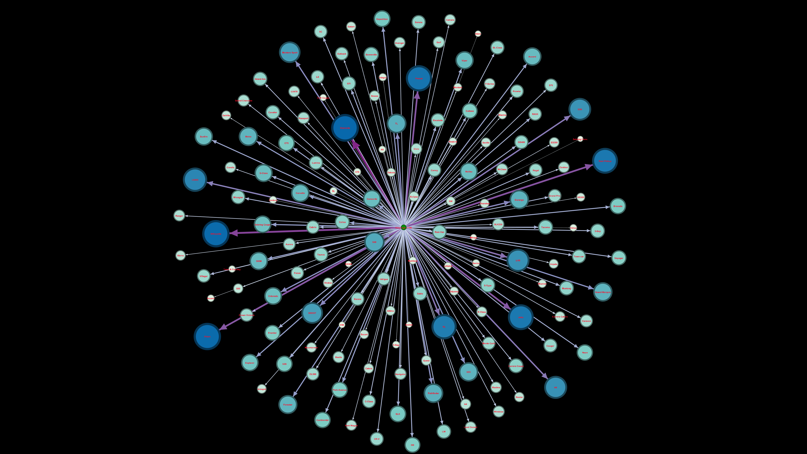

## 🚗 Question 8 - Correlation Between Income and Car Model Choice

**Question:**  
آیا ارتباط خاصی بین سطح درآمد سالیانه مشتریان و نوع خودرو خریداری‌شده وجود دارد؟

**Dataset:**  
`a2-ECDS4-CarSales (Car_Sales_Report)`  
📌 تحلیل با دسته‌بندی درآمدی و بصری‌سازی گراف بین گروه درآمدی و مدل خودرو

**Use Case:**  
🏛️ برای دولت، شرکت‌های بیمه و فروشندگان خودرو جهت تنظیم سیاست‌های فروش، تسهیلات، یا بیمه متناسب با سطح درآمد خریداران

---

### 🧠 Insights

- خوشه‌بندی خریداران خودرو براساس دسته درآمدی (مثلاً 0–50K، 200K–500K، ...)
- مشاهده ارتباط گروه‌های درآمدی با مدل‌های خاص خودرو  
- امکان استفاده برای تحلیل بازار هدف، سیاست‌گذاری فروش و تخصیص منابع

---

### 🧾 Network Design

**🔵 Nodes:**  
- `Annual Income`: گروه درآمدی مشتریان (ثابت)  
- `Model`: مدل‌های مختلف خودرو (تغییرپذیر)

**🔗 Edges:**  
- هر بار که یک گروه درآمدی خودروی خاصی خریده باشد → یک یال ایجاد می‌شود  
- وزن یال = تعداد خرید خودرو توسط آن گروه درآمدی  
- رنگ و ضخامت یال‌ها: بر اساس فراوانی خرید

**🎨 Visual Encoding:**  
- مدل خودرو: آبی  
- گروه درآمد: ثابت (Income Brackets)  
- Degree بالاتر = مدل محبوب‌تر یا گروه خریدار فعال‌تر

---

### 📊 Income Brackets

- `0–50K`  
- `50K–200K`  
- `200K–500K`  
- `500K–1M`  
- `>1M`

---

### 🖼️ Graph Snapshots by Income

  
  
  
  
  

---

### 📁 Included Files

| File Name         | Description                                          |
|-------------------|------------------------------------------------------|
| `8.gephi`         | Full network graph in Gephi                          |
| `nodes.csv`       | Includes car models and income brackets              |
| `edges.csv`       | Links showing who buys what                          |
| `All.png`         | Full graph overview                                  |
| `edit-dataset/`   | Cleaned and categorized dataset                      |
| `*.png`           | Income-segmented network visualizations              |

---

> 📌 *این تحلیل می‌تواند در طراحی طرح‌های اقساطی، نرخ بیمه و پیشنهادهای شخصی‌سازی‌شده نقش مهمی داشته باشد.*

