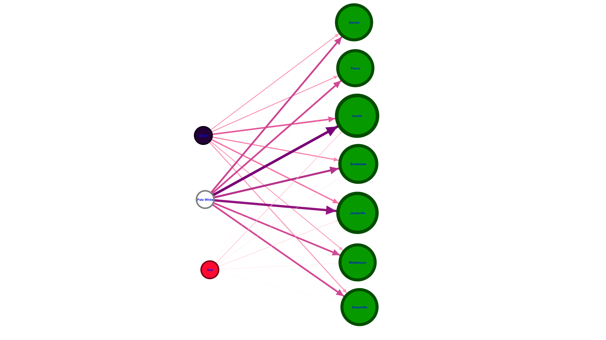
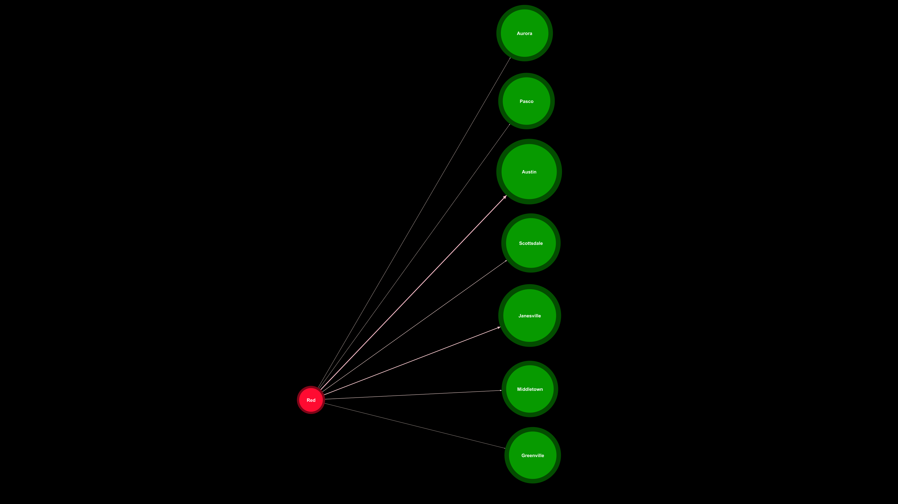
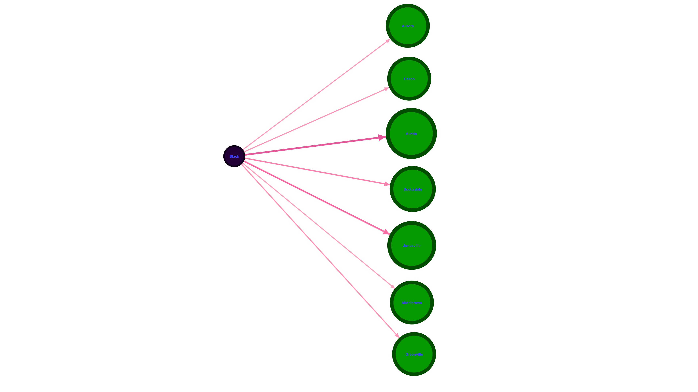
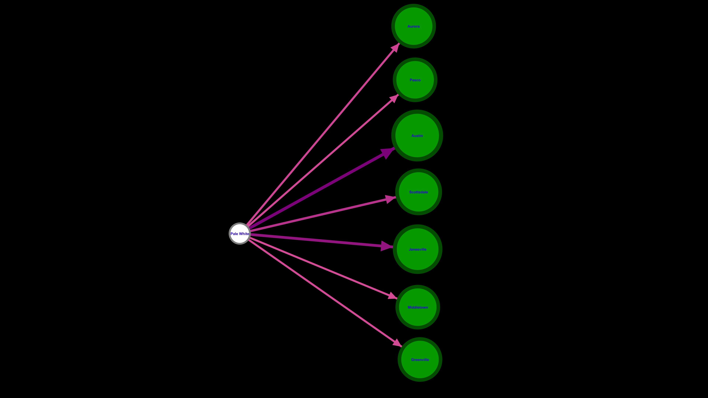

# Social-Business-Network-Analysis-Gephi
A university-level research project focused on social-business network analysis using Gephi. Includes raw data, processed graphs, and insights.

# 📊 Social Business Network Analysis with Gephi

This repository includes a comprehensive set of social network analysis projects using **Gephi** and custom datasets.  
The aim is to analyze customer behavior, product interactions, purchase patterns, and sales trends using **graph-based visualizations**.

---

## 📁 Project Structure

| Folder | Description |
|--------|-------------|
| `1` to `10` | Individual network visualization projects (Gephi `.gephi` files + rendered graphs) |
| `Dataset/` | Contains all datasets used in network modeling and related research questions |
| `README.md` | Overview of the repository |
| `Total Target Questions.pdf` | List of questions addressed by each dataset |
| `Total Possible & Related NetScenes.pdf` | Potential scenarios and analysis contexts |

---

## 📂 Dataset Folder Breakdown

The `Dataset/` folder includes subfolders named based on dataset codes and topics. Each corresponds to a question in the analytical framework.

| Dataset Folder | Question Codes | Topic |
|----------------|----------------|-------|
| `a0/a0-ECDSa16-RestaurantSales` | FM_a0_1_1, FM_a0_2_2 | Restaurant orders and payment timing |
| `a0/a0-ECDSa14-Orders`          | FM_a0_3_3, FM_a0_4_4 | Product bundling and cross-product dependencies |
| `a0/a0-ECDS9-EcTransacts`       | FM_a0_5_5, FM_a0_6_6 | Transaction pattern similarities and travel group patterns |
| `a1/a1-ECDS7-FashionRetails`    | FM_a1_1_7            | Distribution of highly-rated fashion items |
| `a2/a2-ECDS4-CarSales`          | FM_a2_1_8 to FM_a2_3_10 | Car color, region, and customer segmentation |

Each folder contains:
- 📄 CSV/Excel raw data files  
- 🔗 Node and edge tables for network creation  
- 🧠 Cleaned datasets ready for Gephi  
- 🖼️ Sample network visualizations (.png)

---

## 🧠 What is Gephi?

[Gephi](https://gephi.org/) is an open-source network analysis and visualization software.  
We use it to:

- Load nodes and edges from customer/product datasets  
- Explore social and transactional relationships  
- Apply filters, centrality, modularity  
- Render high-quality visual graphs to interpret insights

---

## 🖼️ Network Visualizations from All Projects

  
  
  
  
  
  
  
  
  
  

### 🔹 Car Sales: Region vs Car Color

  
  
  
  

---

### 🔹 Fashion Retail: Highly-Rated Product Network

  
  

---

## 📌 How to Run the Analysis

1. Download and install Gephi → [https://gephi.org](https://gephi.org)
2. Load `.gephi` project files from folders like `10/`  
3. Or import `nodes.csv` + `edges.csv` from `Dataset/` folders
4. Use Gephi features to:
   - Adjust layout (ForceAtlas, Yifan Hu, etc.)
   - Colorize by degree or modularity class
   - Filter based on edge weight or node attributes
   - Export graph as PNG or SVG

---

## 📑 Related Research Questions

Refer to `Total Target Questions.pdf` for a complete list of the analytical questions (coded like FM_a0_1_1).  
Each dataset folder answers at least one research scenario.

---

> 🧠 This repository demonstrates how customer and product data can be explored **as a network** to extract meaningful insights using Gephi.

